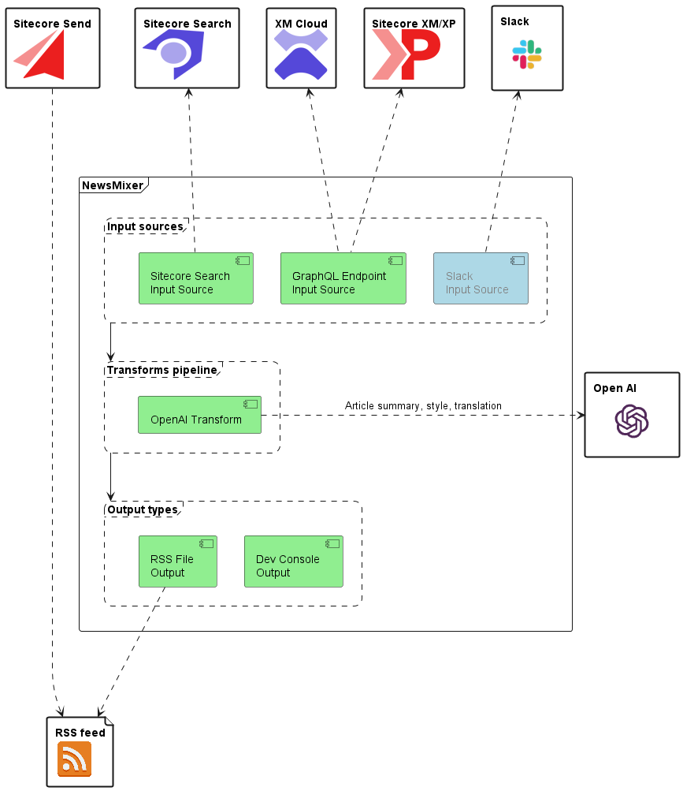

# Sitecore Hackathon 2024

- MUST READ: **[Submission requirements](SUBMISSION_REQUIREMENTS.md)**
- [Entry form template](ENTRYFORM.md)

## Team name

Team 451 Unavailable For Legal Reasons

## Category

Best use of AI

## Description

**News Mixer** is a multilingual AI-driven summary generator, consuming content from one or more sources. The content is then being processed by a variety of configurable AI based transformers to create the summaries in the desired style, after which it is outputted to the desired targets. 

### News Mixer Architecture

All components colored green are implemented in the solution.

### Module Purpose

The purpose of **News Mixer** is to automate the process of providing an overview of (parts of) a specified set of content sources. There are a multitude of use cases for this and to illustrate the potential of **News Mixer** a set of use cases is provided in the following.

#### Localization

For all the use cases the **News Mixer** allows you to create the summaries in any language (supported by the transformer) and thereby making it easy to cater for consumers of the content that might not be proficient in the original language. This provides an option to with less effort to follow relevant sources on a high level and get notified, when there is content of interest - even if you might not understand the original language.

#### Repeatable Newsletter Based RSS

Let your subscribers know what has happened recently on your website in a consice and factual tone of voice. Or let them know which events and courses you have upcoming and want to promote as if you were selling licenses at the end of the fiscal year.

This scenario is implemented as part of the Sitecore 2024 Hackathon submission. The implementation make use of **Sitecore Send**, where both daily and weekly repeatable RSS campaigns have been configured pointing to RSS feeds composed from **Sitecore XM** content, that has been summarized by **News Mixer** leveraging **OpenAI**. As part of the solution all of the content has been generated through OpenAI as well and created in Sitecore XM through the *Authoring* Api.

Obviously this scenario comes in variations: It need not be an RSS feed which is the output, it could for instance be that the newsletter is created on the fly. Likewise it could be other products than **Sitecore Send** used to ship the newsletter. Finally the RSS and newsletter format could have been another output target for instance your organization's Intranet, potentially feeding the generated content back into **Sitecore XM/XP/Cloud**.

#### Digest of Recent Slack Activity

Want to keep up on what is happening on your favorite Sitecore Slack Channels? By extending **News Mixer** with a **Slack** input source you would be able to do exactly that. This will require a **Slack** app installed on the relevant workspace to get API access.

#### Digest New Sitecore Documentation Based on Sitecore Search

Want to ensure the Sitecore Community becomes aware of newly added documentation and become aquainted with the essence of it in their native language?

This scenario is implemented as part of the Sitecore 2024 Hackathon submission. The implementation make use of **Sitecore Search** leveraging Sitecore's own instance for their [Documentation site](https://doc.sitecore.com) Unfortunately the search index does not contain dates to ensure the newest content is pulled, therefore the implementation just consumes content based on a freetext (configurable) search criteria and then follow the URL for the first x (configurable) results.

#### Combination - Sitecore Community News

The use cases could even be combined into one providing for instance localized and summarized overview of relevant activities to the Sitecore Community in the format they desire, syndicating sources like:

- The Sitecore Documentation
- The Sitecore Developer Portal
- The Sitecore MVP Site
- The Sitecore Slack Channels
- etc.

### Currently Supported Input Sources

- GraphQL (Sitecore XM/XP/XM Cloud)
- Sitecore Search

### Currently Supported Transformers

- OpenAI

### Currently Supported Output Targets

- Console
- RSS files (in daily and weekly digests)

## Video link

<!-- TODO -->

## Pre-requisites and Dependencies

- Windows 11
- Visual Studio 2022
- Some Docker engine, for example [Docker Desktop](https://desktop.docker.com/win/stable/amd64/Docker%20Desktop%20Installer.exe)

## Installation instructions

### Setup (once)

#### Initialize solution

1. Run `.\Init.ps1 -LicenseXmlPath "<C:\path\to\license.xml>"`
1. Run `dotnet tool restore`

### Startup

1. Run `.\Invoke-Build.ps1` if you have build tools such as `msbuild`, `nuget` in your path **OR** publish `Platform` project in Visual Studio.
1. Run `docker-compose up -d --build`
1. Run `dotnet sitecore login --authority https://id.team451.localhost --cm https://cm.team451.localhost --allow-write true`
1. Run `dotnet sitecore index schema-populate`
1. Run `dotnet sitecore ser push`

### Configuration

An API Key for OpenAI is necessary. It can be specified in one of the following ways:
* Set OPENAI_APIKEY environment variable on host, eg. by running ``[System.Environment]::SetEnvironmentVariable("OPENAI_APIKEY", "<yourkey>")``
* Set OPENAI_APIKEY in ``.env`` file (and avoid committing that change) and run with docker compose
* Set OPENAI_APIKEY environment variable in ``src\news-mixer\code\Properties\launchSettings.json`` and run with Visual Studio

## Usage instructions

Currently the implemented scenario of **News Mixer** relies on developer configuration. It is executed through a Console Application ``src/news-mixer/code/Program.cs`` which is set as startup project for the solution or can be run by running *news-mixer.exe* after having build the solution.

When running the program five RSS files are created with the configured AI behavior and the output is also sent to the console.

The implemented scenario relies on content from **Sitecore XM** and the [Sitecore Documentation](https://doc.sitecore.com) through its **Sitecore Search** instance. New content can be added by logging into the Sitecore CM instance and creating it. Alternatively a strategy like the one used to seed the sample data for the solution can be used ``src/tools/Invoke-SampleDataSeed.ps1``.

The newsletters are configured in **Sitecore Send** - screenshots of the configuration and the mail sent for two of the feeds are placed in [NewsletterConfigurationAndMail](docs/pdfs/NewsletterConfigurationAndMail.pdf) the same configuration should be imitated on an accessible **Sitecore Send** account if to try out the entire flow.

The RSS feeds are published as Github Pages on the following URL's:

- [Gossipy News Editor, daily](https://sitecore-hackathon.github.io/2024-Team-451-Unavailable-For-Legal-Reasons/gossipy-daily-02-03-2024-en.rss)
- [Gossipy News Editor, weekly](https://sitecore-hackathon.github.io/2024-Team-451-Unavailable-For-Legal-Reasons/gossipy-weekly-week-9-en.rss)
- [Poet, daily](https://sitecore-hackathon.github.io/2024-Team-451-Unavailable-For-Legal-Reasons/poet-daily-02-03-2024.rss)
- [Poet, weekly](https://sitecore-hackathon.github.io/2024-Team-451-Unavailable-For-Legal-Reasons/poet-weekly-week-9.rss)
- [Poet, weekly, Danish](https://sitecore-hackathon.github.io/2024-Team-451-Unavailable-For-Legal-Reasons/poet-weekly-week-9-da.rss)

Please note that the published feeds are not updated as part of the solution, they are generated as files in ``out/`` if run through Docker as described in section [Startup](https://github.com/Sitecore-Hackathon/2024-Team-451-Unavailable-For-Legal-Reasons/tree/dev?tab=readme-ov-file#startup) above. So if to try the entire scenario with other content than the provided feeds - new feeds must be published to a location that can be pointed to in the **Sitecore Send** configuration.

## Comments

### Ideas for future development (apart from input/output sources and transformers)

- Implement usage of Categories (for instance to be used in relation to segmentated content and the structure of Newsletters)
- Add support for images in the RSS feeds.
- Sitecore Module - Repeatable Newsletter Configurator: Let it be up to marketers to configure the RSS Feed output as well as Transformer style for the different category types
- **News Mixer** Admin Interface (Sitecore or alternative): Enable *Role* to generally configure Transformers and Sources and pair them with each other

### Restricted OpenAI usage

In the solution a Source wrapping other sources have been added to limit the amount of content sent through to OpenAI. This is done to **minimize cost, rate limit usages and environmental impact** when using the **News Mixer** PoC.